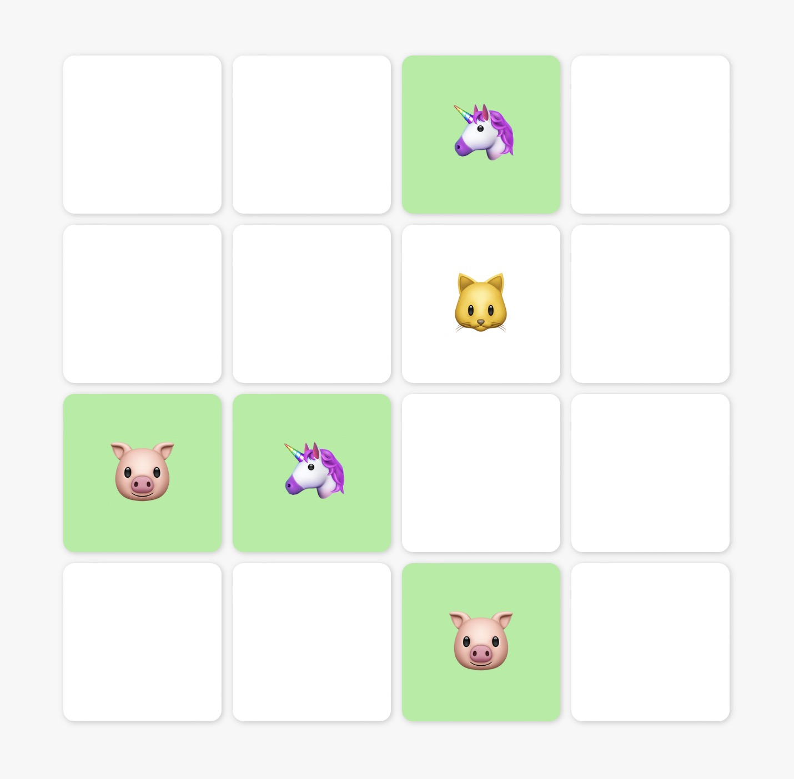

# Memory Card Flip Game - Created by OpenAI Assistant

## Overview

This memory card flip game was created entirely by OpenAI's Assistant, showcasing the power of AI-driven development. With just nine lines of prompting provided in `main.py`, the Assistant generated a complete, playable game tailored for toddlers.

## How It Was Made

The `main.py` script uses OpenAI's API to send a prompt to the Assistant, which then returns a fully functional HTML/JavaScript game. This process demonstrates the Assistant's ability to understand complex tasks and produce ready-to-use code.

## Features

- AI-generated code for a toddler-friendly memory game.
- A simple and intuitive 4x4 grid of cards.
- Responsive design that adapts to the browser's viewport.
- Game logic that includes matching mechanics and victory conditions.

## Running the Game

The game is generated and written to `index.html` by running `main.py`. Ensure you have the necessary API keys and permissions set up for OpenAI's services.

NB: Game generation is not deterministic. This version of `index.html` was created in one shot, but if your generated `index.html` isn't to your liking, just run `main.py` again until you get a version you like.

## Development

The development of this game is a testament to the capabilities of AI in software creation. The `main.py` script is the centerpiece, leveraging OpenAI's API to transform a brief prompt into a complete application.

## Acknowledgements

Created with the assistance of OpenAI's powerful language model, which provided the code generation capabilities to build this game from a simple description.

## License

This project is released under the MIT License, promoting open and collaborative software development.
